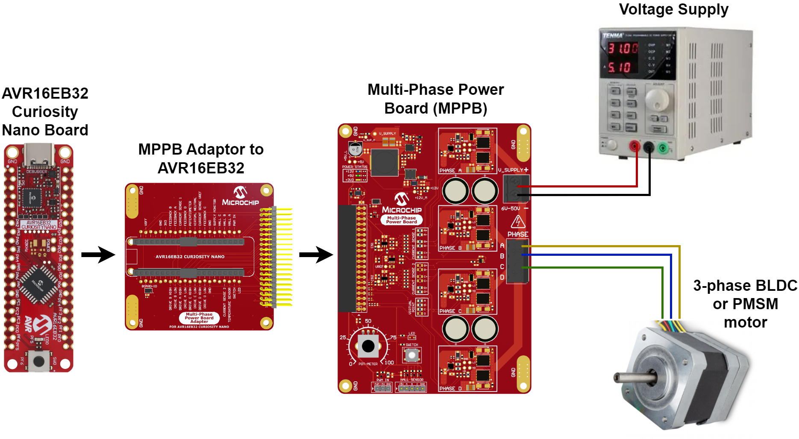
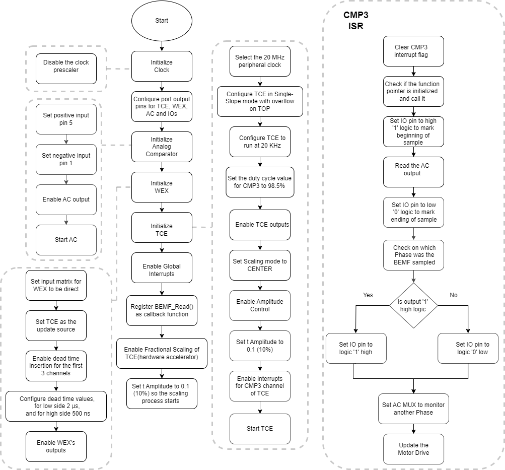

[](https://www.microchip.com)

## BEMF Acquisition Demo

Below is an example of how to set a Timer/Counter type E (TCE) and a Waveform Extension (WEX) instance to generate six complementary Pulse-Width Modulation (PWM) signals to drive Sinusoidal a 3-phase Brushless Direct Current Motor (BLDC), or a Permanent Magnet Synchronous Motor (PMSM). This example also configures the Analog Comparator (AC) peripheral to measure directly the Back Electromotive Force (BEMF), when the motor is spinning. The measurement window is one of the two dead time periods during a PWM cycle. This dead time period is increased to 2 µs to have a big enough acquisition window to detect clean BEMF, that is not influenced by the PWM driving signals. The other dead time period is kept at 500 ns. A full PWM cycle has 50 µs (which is the classic 20KHz frequency of MOSFET switching, used in Motor Control applications). The motor is spinning using forced commutation in this example without any sort of synchronization or Closed Loop algorithms. This code example just highlights the new BEMF measurement method, during dead time.

## Related Documentation

More details and code examples on the AVR16EB32 can be found at the following links:

- [AVR<sup>®</sup> EB Product Page](https://www.microchip.com/en-us/product/AVR16EB32)
- [AVR<sup>®</sup> EB Code Examples on GitHub](https://github.com/microchip-pic-avr-examples?q=AVR16EB32)

## Software Used

- [MPLAB® X IDE v6.15 or newer](https://www.microchip.com/en-us/tools-resources/develop/mplab-x-ide)
- [AVR-Ex DFP-2.8.189 or newer Device Pack](https://packs.download.microchip.com/)
- [MPLAB® XC8 compiler v2.45](https://www.microchip.com/en-us/tools-resources/develop/mplab-xc-compilers/downloads-documentation#XC8)
- [MPLAB® Code Configurator (MCC) v 5.3.7](https://www.microchip.com/en-us/tools-resources/configure/mplab-code-configurator)
- [MPLAB® Code Configurator (MCC) Melody Core v 2.6.3 or newer](https://www.microchip.com/en-us/tools-resources/configure/mplab-code-configurator)

## Hardware Used

- [AVR<sup>®</sup> EB Curiosity Nano](https://www.microchip.com/en-us/product/AVR16EB32)
- [Multi-Phase Power Board (MPPB)](https://www.microchip.com/en-us/product/AVR16EB32)
- [AVR-EB Cnano Adaptor to MPPB](https://www.microchip.com/en-us/product/AVR16EB32)
- A BLDC or PMSM Motor[(Suggestion: Mikroe BLDC motor)](https://www.mikroe.com/motor-bldc-42blf01-with-hall-sensor)
- A Voltage Power Supply (24 - 36V and 1 - 3A is enough)

## Setup

The AVR16EB32 Cnano Development Board is used along with the MPP Power Board, AVR-EB Cnano to MPP Adaptor Board, the BLDC Motor and a Voltage Power Supply.

<br>

## Functionality

<br> The peripheral clock, output port pins, TCE, WEX and AC are initialized and configured using the MPLAB® X Code Configurator. At runtime, the driving sinewave signals are generated using a Lookup Table (LUT). The LUT is scrolled using three 16-bit counters, one for each phase. The drive is updated at every PWM cycle, once every 50 µs. The counters start from different values to ensure the 120 electrical degrees phase shift for the three phases. The BEMF is read once per PWM cycle as well. The counters increment is the actual motor's speed (LUT scrolling speed). The frequency of the sinewave signals is modified by increasing or decreasing the LUT scrolling speed. The amplitude of the sinewave signals is modified using TCE's hardware scaling accelerator.

<br> At runtime the ```BEMF_Read()``` function is called in an Interrupt Service Routine (ISR). ```BEMF_Read()``` function is registered as a callback on the TCE's CMP3 vector ISR. This function gets the output from the AC and sets an IO to high '1' logic if the value is one. If the value from the AC output is zero the IO is set to '0' low logic. Every phase of the motor has an IO to show the sampled BEMF for the respective phase. PF1, PF2 and PF3 pins are used to show the sampled BEMF for the three phases of the motor. PF4 pin is used to mark the sampling moment of the BEMF during the long dead time. The AC has on the negative input the hardware reconstructed neutral phase of the motor. The AC has on the positive input the three phases of the motor, each one at a time, using a Multiplexor (MUX). The AC MUX is switched at every PWM cycle (whenever a new ISR occurs) to monitor a different phase. This means that each phase of the motor is monitored every 150 µs. The AC monitors phase A for 50 µs, then switches to phase B for another 50 µs, then switches to phase C for another 50 µs. After that the process repeats itself over and over again. 

## Function Called in Interrupt Service Routine

```c
void BEMF_Read(void)
{
    bool  bemf_state;
    static mux_t mux = MUX_PHASE_A;

    /* BEMF sampling point marked by an IO toggling */
    IO_PF4_SetHigh();
    bemf_state = ((AC0.STATUS & AC_CMPSTATE_bm) != 0 );
    IO_PF4_SetLow();
    
    /* Switching AC0 MUX from one phase to another one */
    switch(mux)
    {
        case MUX_PHASE_A: if(bemf_state) {IO_PF1_SetHigh();} else {IO_PF1_SetLow();} mux = MUX_PHASE_B; break;
        case MUX_PHASE_B: if(bemf_state) {IO_PF2_SetHigh();} else {IO_PF2_SetLow();} mux = MUX_PHASE_C; break;
        case MUX_PHASE_C: if(bemf_state) {IO_PF3_SetHigh();} else {IO_PF3_SetLow();} mux = MUX_PHASE_A; break;
        default: mux = MUX_PHASE_A; break;
    } 
    
    /* Update Analog Comparator MUX to monitor another phase of the motor */
    Mux_Set(mux);
    
    /* Update drive to keep the motor spinning */
    Motor_Drive();
}
```

## Analog Comparator MUX Setup

<br>

## Application Flowchart

<br>

<br>To generate this project using MPLAB® X IDE and the MPLAB® X Code Configurator (MCC Melody, MCC Clasic is not supported on this device), follow the next steps:

<br>1. Open MPLAB X IDE and create a new project for the AVR16EB32 device.

<br>2. Open MCC from the toolbar (more information on how to install the MCC plug-in can be found [here](https://onlinedocs.microchip.com/pr/GUID-1F7007B8-9A46-4D03-AEED-650357BA760D-en-US-6/index.html?GUID-D98198EA-93B9-45D2-9D96-C97DBCA55267)).

<br>3. From the **MCC Content Manager** tab click the **Select MCC Melody** button and then click **Finish**.<br>
<br>
<br>

<br>4. Click Project _Resources>System>CLKCTRL_, then do the following configuration:
<br>
    <br> - Disable the Prescaler enable button
<br>

<br>5. To add the TCE module, go to _Device Resources>Drivers>Timer>TCE0_, then do the following configuration:
<br>
    <br>  - Module Enable: Must be enabled by default, if not just toggle the button (it turns blue if enabled)
    <br>  - Clock Selection: System clock (by default the divider must be 1 - System clock)
    <br>  - Counter Direction: UP
    <br>  - Waveform Generation Mode: Single-slope PWM mode with overflow on TOP
    <br>  - Requested Period[s]: 0.00005
    <br>  - Duty Cycle 0 [%] : 0
    <br>  - Duty Cycle 1 [%] : 0
    <br>  - Duty Cycle 2 [%] : 0
    <br>  - Duty Cycle 3 [%] : 98.5
    <br>  - Waveform Output n : check the boxes from the Enable column for Waveform Output 0, 1, 2, 3
    <br>  - Scale mode: CMP values are scaled from Center, 50% DC (duty cycle)
    <br>  - Scaled Writing to registers: Normal
    <br>  - Amplitude Control Enable: toggle the button (it turns blue if enabled)
    <br>  - Amplitude Value: 0.1
    <br>  - Generate ISR: toggle the button (it turns blue if enabled)
    <br>  - Compare 3 Interrupt Enable: toggle the button (it turns blue if enabled)
<br>

<br>6. To add the WEX module, go to _Device Resources>Drivers>WEX>WEX0_, then do the following configuration:
<br>
  <br> - Input Matrix: Direct
  <br> - Update Source: TCE (the update condition for the output signals will be dictated by TCE)
  <br> - Override Settings: Check all the boxes from the Output Enable column for the Waveform Output [0-5]
  <br> - Dead-time Insertion Channel 0 Enable: toggle the button (it turns blue if enabled)
  <br> - Dead-time Insertion Channel 1 Enable: toggle the button (it turns blue if enabled)
  <br> - Dead-time Insertion Channel 2 Enable: toggle the button (it turns blue if enabled)
  <br> - Requested Dead-time Low Side (μs) : 2
  <br> - Requested Dead-time High Side (μs) : 0.5
<br>

<br>7. To add the AC module, go to _Device Resources>Drivers>AC>AC0_, then do the following configuration:
<br>
  <br> - Enable: toggle the button (it turns blue if enabled)
  <br> - Positive Input MUX Seection: Positive Pin 5
  <br> - Negative Input MUX Seection: Negative Pin 1
  <br> - Output Pad Enable: toggle the button (it turns blue if enabled)
<br>

<br>8. In the **Pin Grid View** tab check if the WEX_WO [0-5] pins are locked as outputs on PORTA. When the boxes from the Enable column in the Output Settings of WEX are checked, the pins are also locked. To change the PORT simply click a pin from another PORT in **Pin Grid View**. Check if PA7 pin is set as AC output. Check if PD4 and PD0 pins are set as inputs for AC. Also, another two pins are needed as inputs for AC for the other two phases of the motor. Click on PD5 and PD6 and set them as inputs from _Pins -> GPIO_. Last, the pins that show the sampled BEMF and the sampling moment must be set as outputs from _Pins -> GPIO_. These pins are PF1, PF2, PF3 and PF4.

 |            Pin           |     Configuration     |
 | :---------------------:  | :----------------:    |
 |            PA0           |   TCE & WEX WO0       |
 |            PA1           |   TCE & WEX WO1       |
 |            PA2           |   TCE & WEX WO2       |
 |            PA3           |   TCE & WEX WO3       |
 |            PA4           |   TCE & WEX WO4       |
 |            PA5           |   TCE & WEX WO5       |
 |            PA7           |   AC output           |
 |            PD0           |   AC negative input 1 |
 |            PD4           |   AC positive input 5 |
 |            PD5           |   AC positive input 6 |
 |            PD6           |   AC positive input 3 |
 |            PF1           |   digital output      |
 |            PF2           |   digital output      |
 |            PF3           |   digital output      |
 |            PF4           |   digital output      |

<br>

<br> Go to the _Project Resources>System>Pins_. Select the Digital Input Buffer disabled option for PD5 and PD6 pins.
<br>

<br>9. In the **Project Resources** tab, click the **Generate** button so that MCC will generate all the specified drivers and configurations.
<br>
<br>
<br>
<br>

<br>10. After MCC Melody generates the project files with the configuration explained above, overwrite the content from the ```main.c``` file with this:

```c
/* Number of pole pairs of a BLDC motor */
#define MOTOR_PAIR_POLES                    4

/* MOSFET switching frequency in Hz */
#define F_SAMPLING                          20000.0

/* uint16_t range mapping: 0 - 359.99 electrical degrees -> 0 - 65535 */
#define DEGREES_TO_U16(DEG)                 (uint16_t)( (float)(DEG) * 65536.0 / 360.0 + 0.5)

/* Speed conversion from RPM to LUT scrolling speed */
#define RPM_TO_U16(RPM)                     (uint16_t)(((float)(RPM) * 65536.0 * (float)(MOTOR_PAIR_POLES)) / ((float)(F_SAMPLING) * 60.0) + 0.5)

/* Sets the amplitude of the sine wave signals, and thus the scaling values of duty cycle in U.Q.1.15 format, ranging from 0 to 1.00 
 * Duty cycle scaling is done in hardware using the hardware accelerator of TCE.*/
#define AMP_TO_U16(X)                       (uint16_t)(32768.0*(X) + 0.5)

/* Speed of the motor - 120 RPM */
#define SPEED                               RPM_TO_U16(120)

/* Amplitude of the sine wave - 10% */
#define AMPLITUDE                           AMP_TO_U16(0.1)


#include "mcc_generated_files/system/system.h"

typedef enum
{
    MUX_PHASE_A = (AC_MUXPOS_AINP5_gc | AC_MUXNEG_AINN1_gc),
    MUX_PHASE_B = (AC_MUXPOS_AINP6_gc | AC_MUXNEG_AINN1_gc),
    MUX_PHASE_C = (AC_MUXPOS_AINP3_gc | AC_MUXNEG_AINN1_gc),
} mux_t;

/* LUT that is used to generate a sinusoidal drive */
static const uint16_t sine_lookup_table[] = 
{
  16384, 16786, 17187, 17589, 17989, 18389, 18788, 19185, 19580, 19973, 20364, 
  20753, 21140, 21523, 21903, 22280, 22653, 23023, 23389, 23750, 24107, 24459, 24807, 
  25149, 25486, 25818, 26143, 26463, 26777, 27085, 27386, 27681, 27969, 28250, 28523, 
  28790, 29049, 29300, 29543, 29779, 30006, 30226, 30437, 30639, 30833, 31018, 31194, 
  31362, 31520, 31670, 31810, 31941, 32062, 32174, 32276, 32369, 32453, 32526, 32590, 
  32644, 32689, 32723, 32748, 32763, 32768, 32763, 32748, 32723, 32689, 32644, 32590, 
  32526, 32453, 32369, 32276, 32174, 32062, 31941, 31810, 31670, 31520, 31362, 31194, 
  31018, 30833, 30639, 30437, 30226, 30006, 29779, 29543, 29300, 29049, 28790, 28523, 
  28250, 27969, 27681, 27386, 27085, 26777, 26463, 26143, 25818, 25486, 25149, 24807, 
  24459, 24107, 23750, 23389, 23023, 22653, 22280, 21903, 21523, 21140, 20753, 20364, 
  19973, 19580, 19185, 18788, 18389, 17989, 17589, 17187, 16786, 16384, 15981, 15580, 
  15178, 14778, 14378, 13979, 13582, 13187, 12794, 12403, 12014, 11627, 11244, 10864, 
  10487, 10114, 9744, 9378, 9017, 8660, 8308, 7960, 7618, 7281, 6949, 6624, 6304, 5990, 
  5682, 5381, 5086, 4798, 4517, 4244, 3977, 3718, 3467, 3224, 2988, 2761, 2541, 2330, 
  2128, 1934, 1749, 1573, 1405, 1247, 1097, 957, 826, 705, 593, 491, 398, 314, 241, 
  177, 123, 78, 44, 19, 4, 0, 4, 19, 44, 78, 123, 177, 241, 314, 398, 491, 593, 705, 
  826, 957, 1097, 1247, 1405, 1573, 1749, 1934, 2128, 2330, 2541, 2761, 2988, 3224, 
  3467, 3718, 3977, 4244, 4517, 4798, 5086, 5381, 5682, 5990, 6304, 6624, 6949, 7281, 
  7618, 7960, 8308, 8660, 9017, 9378, 9744, 10114, 10487, 10864, 11244, 11627, 12014, 
  12403, 12794, 13187, 13582, 13979, 14378, 14778, 15178, 15580, 15981
};

/* Function that is called every 50us to update the drive */
void Motor_Drive(void)
{
/* Counters that scroll through the LUT at runtime. These counter are used to create the 120 degrees 
 * phase shift between each of the motor's phases */
    static uint16_t     phase_a = DEGREES_TO_U16(0.0);
    static uint16_t     phase_b = DEGREES_TO_U16(120.0);
    static uint16_t     phase_c = DEGREES_TO_U16(240.0);
    static const uint16_t speed = SPEED;

    /* Values that will be written in the CMP channels of TCE */
    uint16_t drive_a, drive_b, drive_c;
    
    /* Updating the counters */
    phase_a += speed;
    phase_b += speed;
    phase_c += speed;
    
    /* Select new variables from the LUT for each CMP channel */
    drive_a = sine_lookup_table[(phase_a >> 8)];
    drive_b = sine_lookup_table[(phase_b >> 8)];
    drive_c = sine_lookup_table[(phase_c >> 8)];
    
    /* Update the values from CMP channels with new ones */
    TCE0_CompareChannels012BufferedSet(drive_a, drive_b, drive_c);
}

/* Functions that switches the MUX to monitor all 3 phases at runtime */
void Mux_Set(uint8_t mode)
{
    uint8_t temp;
    temp = AC0.MUXCTRL;
    temp &= ~(AC_MUXPOS_gm | AC_MUXNEG_gm);
    temp |= mode;
    AC0.MUXCTRL = temp;
}

/* Function that is called during the enlarged dead time to read the BEMF state */
void BEMF_Read(void)
{
    bool  bemf_state;
    static mux_t mux = MUX_PHASE_A;

    /* BEMF sampling point marked by an IO toggling */
    IO_PF4_SetHigh();
    bemf_state = ((AC0.STATUS & AC_CMPSTATE_bm) != 0 );
    IO_PF4_SetLow();
    
    /* Switching AC0 MUX from one phase to another one */
    switch(mux)
    {
        case MUX_PHASE_A: if(bemf_state) {IO_PF1_SetHigh();} else {IO_PF1_SetLow();} mux = MUX_PHASE_B; break;
        case MUX_PHASE_B: if(bemf_state) {IO_PF2_SetHigh();} else {IO_PF2_SetLow();} mux = MUX_PHASE_C; break;
        case MUX_PHASE_C: if(bemf_state) {IO_PF3_SetHigh();} else {IO_PF3_SetLow();} mux = MUX_PHASE_A; break;
        default: mux = MUX_PHASE_A; break;
    } 
    
    /* Update Analog Comparator MUX to monitor another phase of the motor */
    Mux_Set(mux);
    
    /* Update drive to keep the motor spinning */
    Motor_Drive();
}

int main(void)
{
    SYSTEM_Initialize();
    
    /* Register the BEMF sampling function as a callback */
    TCE0_Compare3CallbackRegister(BEMF_Read);
    
    /* Enable hardware scaling accelerator after initialization to avoid messing up 
     * the timing for reading BEMF with CMP3 channel of TCE */
    TCE0_ScaleEnable(true);
    
    /* Set the Amplitude level */
    TCE0_AmplitudeSet(AMPLITUDE);
    
    while(1)
    {
    }    
}
```

<br>11. Now the project can be built and run from MPLAB X IDE. At run time, while the motor is spinning, the BEMF from each phase of the motor is sampled with the AC and displayed using some output GPIO pins. It can be observed that the measured BEMF follows the Sinusoidal Drive signals of the motor's phases.

 ## Operation

 1. Connect the board to the PC.

 2. Open the ```BEMF_Acquisition_Demo.X``` or solution in MPLAB X IDE.

 3. Right click the project and select Set as main project.

<br>

 4. Build the ```BEMF_Acquisition_Demo.X``` project by clicking **Clean and Build Project**.

<br>

 5. Click **Make and Program Device** to program the project to the board.

<br>

## Results

Below are some logic analyzer captures, to help understand how the six PWM signals that generate the 3-phases sinusoidal drive look, and how the sampled BEMF follows the drive signals:

<br>Sampling point of BEMF during dead time:
<br>

<br>Sampled BEMF for one phase of the motor:
<br>

<br>All 3 phases of the motor with their sampled BEMF signals. In this capture the phase signals are filtered with a hardware low pass filter in order to observe the sinusoidal drive:
<br>

## Summary

This project shows how to use the TCE & WEX to generate PWM signals in Single-Ramp mode to drive a 3-phase BLDC or PMSM motor, and use the AC to measure BEMF during the dead time period.