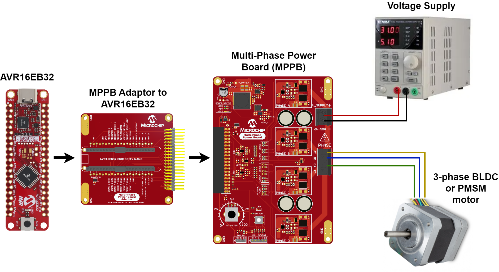

# BEMF Acquisition During Dead Time

This repository contains an example of MPLAB® Code Configurator (MCC) Melody generated source code for the Timer/Counter Type E (TCE), Waveform Extension (WEX) and Analog Comparator (AC) peripherals of the AVR® EB family of devices. There is one appication described in this document. The application's functionality is explained.

* [<strong>BEMF Acquisition Demo:</strong>](BEMF_Acquisition_Demo) This use case shows a new method to detect and measure Back Electromotive Force (BEMF), in an Motor Control application for Brushless Direct Current Motors (BLDC), or Permanent Magnet Synchronous Motors (PMSM), that are driven with a Sinusoidal Drive. In a Sinusoidal Drive all the 3 phases of the motor are driven constantly. There are no floating phases, like in the Trapezoidal Drive with 6-step block commutation. By increasing the duration of one dead time up to 5 times compared to the other one, this method can measure the BEMF using an AC peripheral.

## Related Documentation

More details and code examples on the AVR16EB32 can be found at the following links:

- [AVR® EB Product Page](https://www.microchip.com/en-us/product/AVR16EB32)
- [AVR® EB Code Examples on GitHub](https://github.com/microchip-pic-avr-examples?q=AVR16EB32)

## Software Used

- [MPLAB® X IDE v6.15 or newer](https://www.microchip.com/en-us/tools-resources/develop/mplab-x-ide)
- [AVR-Ex DFP-2.8.189 or newer Device Pack](https://packs.download.microchip.com/)
- [MPLAB® XC8 compiler v2.45](https://www.microchip.com/en-us/tools-resources/develop/mplab-xc-compilers/downloads-documentation#XC8)
- [MPLAB® Code Configurator (MCC) v 5.3.7](https://www.microchip.com/en-us/tools-resources/configure/mplab-code-configurator)
- [MPLAB® Code Configurator (MCC) Melody Core v 2.6.2 or newer](https://www.microchip.com/en-us/tools-resources/configure/mplab-code-configurator)

## Hardware Used

- [AVR® EB Curiosity Nano](https://www.microchip.com/en-us/product/AVR16EB32)
- [Multi-Phase Power Board (MPPB)](https://www.microchip.com/en-us/product/AVR16EB32)
- [AVR-EB Cnano Adaptor to MPPB](https://www.microchip.com/en-us/product/AVR16EB32)
- A BLDC or PMSM Motor[(Suggestion: Mikroe BLDC motor)](https://www.mikroe.com/motor-bldc-42blf01-with-hall-sensor)
- A Voltage Power Supply (24 - 36V and 1 - 3A is enough)

## Setup

The AVR16EB32 Cnano Development Board is used along with the MPP Power Board, AVR-EB Cnano to MPP Adaptor Board, the BLDC Motor and a Voltage Power Supply.

 